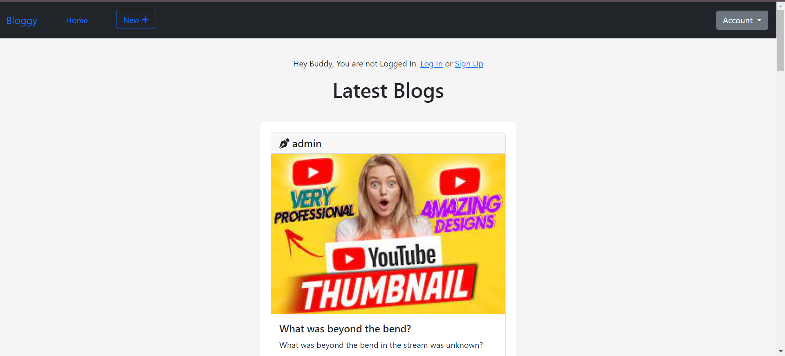
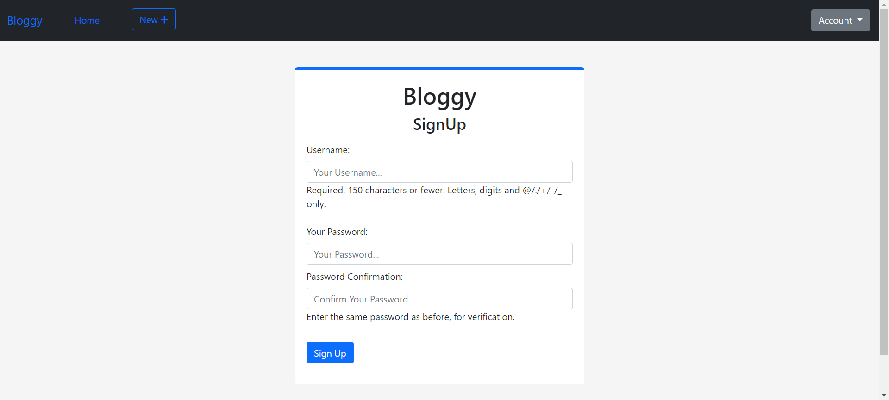
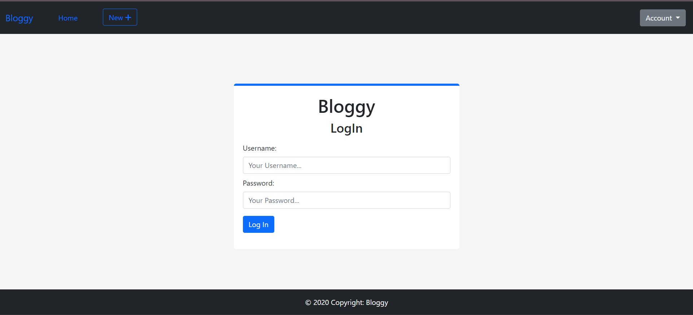
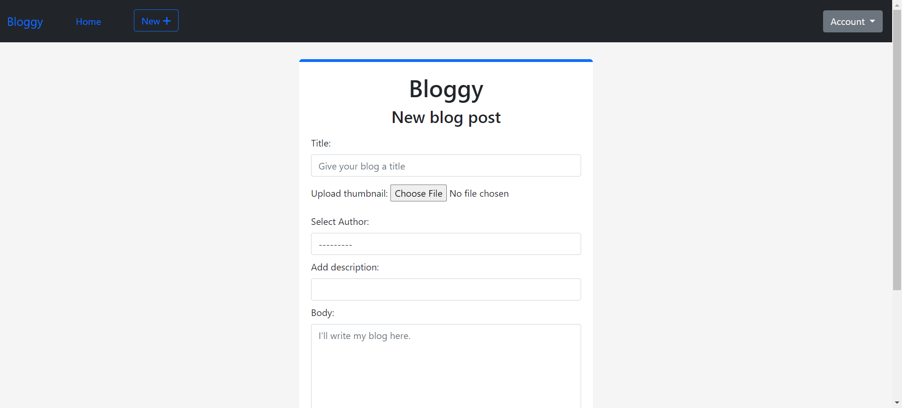
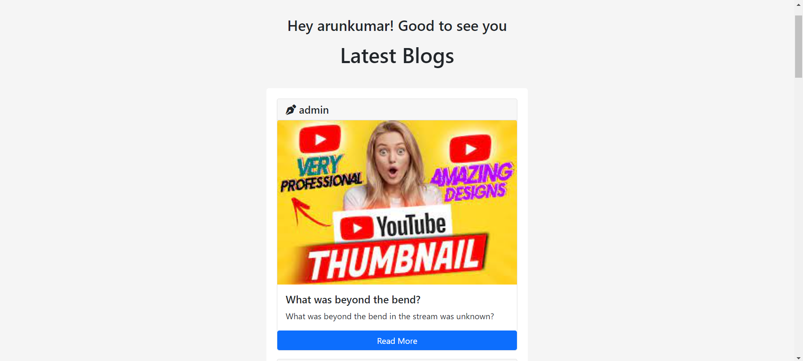
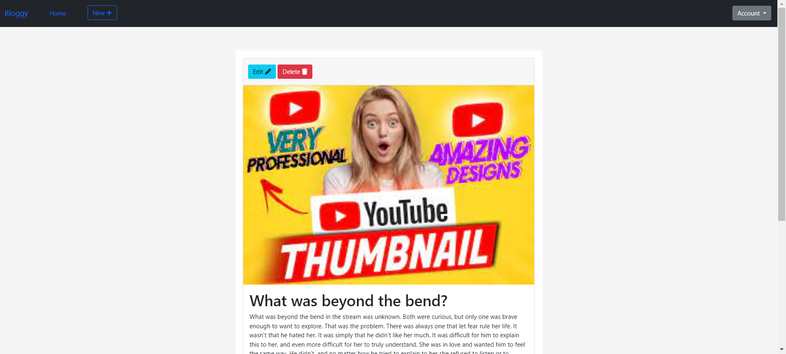
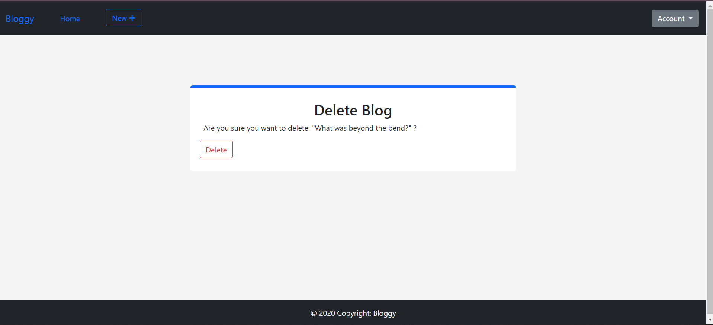

# Bloggy - A Django Blog Application

Welcome to the Bloggy, This web application allows users to create, read, update, and delete blog posts. It comes equipped with Django's default user authentication system, ensuring a secure and personalized experience for bloggers.



## Features
+ User Authentication: Used Django's built-in authentication to ensure secure access to the blog.
+ CRUD Functionality: Create, Read, Update, and Delete blog posts effortlessly.

# Setup Instructions
Follow these steps to set up the Django Blog application on your local machine:

1. Clone the Repository:
```bash
git clone https://github.com/arunkumar02042002/blog_app_django.git
cd django-blog
```

2. Create Virtual Environment:
```bash
python -m venv venv
```

3. Activate Virtual Environment:

*On Windows:*
``
venv\Scripts\activate
``
*On macOS/Linux:*
```
source venv/bin/activate
```

4. Install Dependencies:
```
pip install -r requirements.txt
```

5. Apply Migrations:
```
python manage.py migrate
```

6. Create Superuser:
```
python manage.py createsuperuser
```

7. Run the Development Server:
```
python manage.py runserver
```

8. Access the Application: Open your web browser and go to http://127.0.0.1:8000/

9. Access the Admin Panel: Navigate to http://127.0.0.1:8000/admin/ and log in with the superuser credentials.

## Usage

1. Create a Blog Post:

    i. Create an account - Click on the signup button and create account

    

    ii. Login: Now, you must login with your credentials.

    

    iii. Create New Blog: Once Logged In, click on the new button to create a new Blog.

    

    *click on save*

2. Read, Update, and Delete:

    i. Navigate to the home page to view existing blog posts.
    

    ii. Click on a blog post to read it.
    

    iii. Use the edit and delete buttons to update or remove a post.

    Edit Page:
    

    Delet page:
    


## Contributing
Contributions are welcome! If you find any issues or have suggestions for improvements, feel free to open an issue or submit a pull request.